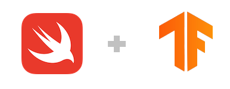

<p align="center">
  
</p>

# Swift for TensorFlow (Archived)

Swift for TensorFlow was an experiment in the next-generation platform for machine learning, incorporating the latest research across machine learning, compilers, differentiable programming, systems design, and beyond.  It was archived in February 2021.  Some significant achievements from this project include:

* Added [language-integrated differentiable programming](https://forums.swift.org/t/differentiable-programming-for-gradient-based-machine-learning/42147) into the Swift language.  This work continues in the official Swift compiler. 
* Developed a mutable-value-semantics-oriented [deep learning API](https://github.com/tensorflow/swift-apis).
* Fostered the development of [a model garden](https://github.com/tensorflow/swift-models) with more than [30 models from a variety of deep learning disciplines](https://github.com/tensorflow/swift-models#examples).
* Enabled novel research that [combines deep learning with probabilistic graphical models](https://github.com/borglab/SwiftFusion) for 3D motion tracking and beyond.
* Powered a(n almost) pure-Swift prototype of a [GPU+CPU runtime supporting parallel map](https://github.com/ewconnell/swiftrt).
* Spun off multiple open source side efforts which continue to be under active development:
  * [PythonKit](https://github.com/pvieito/PythonKit): Python interoperability with Swift.
  * [swift-jupyter](https://github.com/google/swift-jupyter): Enables use of Swift within Jupyter notebooks.
  * [swift-benchmark](https://github.com/google/swift-benchmark): Provides a robust benchmarking suite for Swift code.
* Spun off several other open source efforts:
  * [penguin](https://github.com/saeta/penguin): Parallel programming, data structures, graph algorithms, and more.
  * [Tensors Fitting Perfectly](https://github.com/google-research/swift-tfp): Static analysis of tensor shape mismatches.
* Swift Evolution proposals pitched, implemented, and accepted:
  * [SE-0195](https://github.com/apple/swift-evolution/blob/main/proposals/0195-dynamic-member-lookup.md): User-defined "Dynamic Member Lookup" Types (`@dynamicMemberLookup`)
  * [SE-0216](https://github.com/apple/swift-evolution/blob/main/proposals/0216-dynamic-callable.md): Introduce user-defined dynamically "callable" types (`@dynamicCallable`)
  * [SE-0233](https://github.com/apple/swift-evolution/blob/main/proposals/0233-additive-arithmetic-protocol.md): Make `Numeric` refine a new `AdditiveArithmetic` protocol
  * [SE-0253](https://github.com/apple/swift-evolution/blob/main/proposals/0253-callable.md): Callable values of user-defined nominal types (`func callAsFunction`)

This site will not receive further updates.  The API documentation and binary downloads will continue to be accessible as well as the [Open Design Review meeting recordings](https://docs.google.com/document/d/1Fm56p5rV1t2Euh6WLtBFKGqI43ozC3EIjReyLk-LCLU/edit).


## Getting started

### Using Swift for TensorFlow

- **Google Colaboratory**: The fastest way to get started is to try out Swift
   for TensorFlow right in your browser. Just open up [a tutorial](#tutorials-),
   or start from a [blank notebook][blank_notebook]!
   Read more in our [usage guide](Usage.md).

- **Install locally**: You can [download a pre-built Swift for TensorFlow
   package](Installation.md). After installation, you can follow these
   [step-by-step instructions](Usage.md) to build and execute a Swift script on
   your computer.

- **Run on GCP**: You can spin up a GCE instance using a Swift for TensorFlow
  [Deep Learning VM][dlvm] image, with all drivers and the toolchain
  pre-installed. Instructions can be found in the
  [Installation Guide](Installation.md).

- **Compile from source**: If you'd like to customize Swift for TensorFlow or
   contribute back, follow our [instructions][instructions]
   on building Swift for TensorFlow from source.

### Tutorials 

Tutorial | Last Updated |
-------- | ------------ |
[A Swift Tour](https://colab.research.google.com/github/tensorflow/swift/blob/main/docs/site/tutorials/a_swift_tour.ipynb) | March 2019
[Protocol-Oriented Programming & Generics](https://colab.research.google.com/github/tensorflow/swift/blob/main/docs/site/tutorials/protocol_oriented_generics.ipynb) | August 2019
[Python Interoperability](https://colab.research.google.com/github/tensorflow/swift/blob/main/docs/site/tutorials/python_interoperability.ipynb) | March 2019
[Custom Differentiation](https://colab.research.google.com/github/tensorflow/swift/blob/main/docs/site/tutorials/custom_differentiation.ipynb) | March 2019
[Sharp Edges in Differentiability](https://colab.research.google.com/github/tensorflow/swift/blob/main/docs/site/tutorials/Swift_autodiff_sharp_edges.ipynb) | November 2020
[Model Training Walkthrough](https://colab.research.google.com/github/tensorflow/swift/blob/main/docs/site/tutorials/model_training_walkthrough.ipynb) | March 2019
[Raw TensorFlow Operators](https://colab.research.google.com/github/tensorflow/swift/blob/main/docs/site/tutorials/raw_tensorflow_operators.ipynb) | December 2019
[Introducing X10, an XLA-Based Backend](https://colab.research.google.com/github/tensorflow/swift/blob/main/docs/site/tutorials/introducing_x10.ipynb) | May 2020

### Resources

- [Models and Examples](https://github.com/tensorflow/swift-models)
- [TensorFlow Swift API Reference](https://www.tensorflow.org/swift/api_docs/Structs/Tensor)
- [Release Notes](RELEASES.md)
- [Known Issues](KNOWN_ISSUES.md)
- [Frequently Asked Questions](FAQ.md)
- [TensorFlow Blog Posts](https://blog.tensorflow.org/search?label=Swift)

### Forums

The discussions happened on the
[swift@tensorflow.org mailing list](https://groups.google.com/a/tensorflow.org/d/forum/swift).

## Why Swift for TensorFlow?

Swift for TensorFlow is a new way to develop machine learning models. It
gives you the power of
[TensorFlow](https://www.tensorflow.org) directly integrated into the
[Swift programming language](https://swift.org/about). We believe that
machine learning paradigms are so important that they deserve
**first-class language and compiler support**.

A fundamental primitive in machine learning is gradient-based optimization:
computing function derivatives to optimize parameters. With Swift for
TensorFlow, you can easily differentiate functions using differential
operators like [`gradient(of:)`](https://www.tensorflow.org/swift/api_docs/Functions#/s:10TensorFlow8gradient2of15CotangentVectorQzxcq_xc_tAA14DifferentiableRzSFR_AaFR_AdaFPQy_Rs_r0_lF), or differentiate with respect to an entire
model by calling method [`gradient(in:)`](https://www.tensorflow.org/swift/api_docs/Protocols/Differentiable#/s:10TensorFlow14DifferentiablePAAE8gradient2in15CotangentVectorQzqd__xXE_tSFRd__AaBRd__AfCQyd__Rsd__lF). These differentiation APIs
are not just available for `Tensor`-related concepts—they are
generalized for all types that conform to the [`Differentiable`](https://www.tensorflow.org/swift/api_docs/Protocols/Differentiable)
protocol, including `Float`, `Double`, SIMD vectors, and your own data
structures.

```swift
// Custom differentiable type.
struct Model: Differentiable {
    var w: Float
    var b: Float
    func applied(to input: Float) -> Float {
        return w * input + b
    }
}

// Differentiate using `gradient(at:_:in:)`.
let model = Model(w: 4, b: 3)
let input: Float = 2
let (𝛁model, 𝛁input) = gradient(at: model, input) { model, input in
    model.applied(to: input)
}

print(𝛁model) // Model.TangentVector(w: 2.0, b: 1.0)
print(𝛁input) // 4.0
```

Beyond derivatives, the Swift for TensorFlow project comes with a sophisticated toolchain
to make users more productive. You can run Swift interactively in a Jupyter
notebook, and get helpful autocomplete suggestions to help you explore the
massive API surface of a modern deep learning library. You can [get started
right in your browser in
seconds](https://colab.research.google.com/github/tensorflow/swift/blob/main/docs/site/tutorials/model_training_walkthrough.ipynb)!

Migrating to Swift for TensorFlow is really easy thanks to Swift's powerful
Python integration. You can incrementally migrate your Python code over (or
continue to use your favorite Python libraries), because you can easily call
your favorite Python library with a familiar syntax:

```swift
import TensorFlow
import Python

let np = Python.import("numpy")

let array = np.arange(100).reshape(10, 10)  // Create a 10x10 numpy array.
let tensor = Tensor<Float>(numpy: array)  // Seamless integration!
```

## Documentation

> Beware: the project is moving very quickly, and thus some of these documents
> are slightly out of date as compared to the current state-of-the-art.

### Overview

Document | Last Updated | Status |
-------- | ------------ | ------ |
[Why *Swift* for TensorFlow?](docs/WhySwiftForTensorFlow.md) | April 2018 | Current
[Swift for TensorFlow Design Overview](docs/DesignOverview.md) | April 2018 | Outdated
[Supported Backends](docs/SupportedBackends.md) | May 2020 | Current

### Technology deep dive

The Swift for TensorFlow project builds on top of powerful theoretical
foundations. For insight into some of the underlying technologies, check
out the following documentation.

Document | Last Updated | Status |
-------- | ------------ | ------ |
[Swift Differentiable Programming Manifesto](https://github.com/apple/swift/blob/main/docs/DifferentiableProgramming.md) | January 2020 | Current
[Swift Differentiable Programming Implementation Overview](https://docs.google.com/document/d/1_BirmTqdotglwNTOcYAW-ib6mx_jl-gH9Dbg4WmHZh0) | August 2019 | Current
[Swift Differentiable Programming Design Overview](https://docs.google.com/document/d/1bPepWLfRQa6CtXqKA8CDQ87uZHixNav-TFjLSisuKag/edit?usp=sharing) | June 2019 | Outdated
[Differentiable Types](docs/DifferentiableTypes.md) | March 2019 | Outdated
[Differentiable Functions and Differentiation APIs](docs/DifferentiableFunctions.md) | March 2019 | Outdated
[Dynamic Property Iteration using Key Paths](docs/DynamicPropertyIteration.md) | March 2019 | Current
[Hierarchical Parameter Iteration and Optimization](docs/ParameterOptimization.md) | March 2019 | Current
[First-Class Automatic Differentiation in Swift: A Manifesto](https://gist.github.com/rxwei/30ba75ce092ab3b0dce4bde1fc2c9f1d) | October 2018 | Outdated
[Automatic Differentiation Whitepaper](docs/AutomaticDifferentiation.md) | April 2018 | Outdated
[Python Interoperability](docs/PythonInteroperability.md) | April 2018 | Current
[Graph Program Extraction](docs/GraphProgramExtraction.md) | April 2018 | Outdated

## Source code

Compiler and standard library development happens on the `main` branch of the
[apple/swift](https://github.com/apple/swift/tree/main) repository.

Additional code repositories that make up the core of the project include:

 - [Deep learning library](https://github.com/tensorflow/swift-apis): high-level
   API familiar to Keras users.

> Swift for TensorFlow is **no longer** a fork of the official Swift language;
> development was previously done on the `tensorflow` branch of the
> [apple/swift](https://github.com/apple/swift/tree/tensorflow) repository.
> Language additions were designed to fit with the direction of Swift and are
> going through the [Swift Evolution](https://github.com/apple/swift-evolution)
> process.

### Jupyter Notebook support

[Jupyter Notebook](http://jupyter.org/) support for Swift is under development at
[google/swift-jupyter](https://github.com/google/swift-jupyter).

### Model garden

[tensorflow/swift-models](https://github.com/tensorflow/swift-models) is a
repository of machine learning models built with Swift for TensorFlow. It
intended to provide examples of how to use Swift for TensorFlow, to allow for
end-to-end tests of machine learning APIs, and to host model benchmarking
infrastructure.

### SwiftAI

[fastai/swiftai](https://github.com/fastai/swiftai) is a high-level API for
Swift for TensorFlow, modeled after the
[fastai Python library](https://github.com/fastai/fastai).

## Community

Swift for TensorFlow discussions happen on the
[swift@tensorflow.org mailing list](https://groups.google.com/a/tensorflow.org/d/forum/swift).

### Bugs reports and feature requests

Before reporting an issue, please check the [Frequently Asked Questions](FAQ.md)
to see if your question has already been addressed.

For questions about general use or feature requests, please send an email to
the [mailing list](mailto:swift@tensorflow.org) or search for relevant issues
in the [JIRA issue tracker](https://bugs.swift.org/projects/TF/issues/?filter=allopenissues).

For the most part, the core team's development is also tracked in
[JIRA](https://bugs.swift.org/secure/RapidBoard.jspa?rapidView=17&projectKey=TF&view=planning).

### Contributing

We welcome contributions from everyone. Read the [contributing
guide](Contributing.md) for information on how to get started.

### Code of conduct

In the interest of fostering an open and welcoming environment, we as
contributors and maintainers pledge to making participation in our project and
our community a harassment-free experience for everyone, regardless of age, body
size, disability, ethnicity, gender identity and expression, level of
experience, education, socio-economic status, nationality, personal appearance,
race, religion, or sexual identity and orientation.

The Swift for TensorFlow community is guided by our [Code of
Conduct](CODE_OF_CONDUCT.md), which we encourage everybody to read before
participating.

[blank_notebook]: https://colab.research.google.com/notebook#create=true&language=swift
[dlvm]: https://cloud.google.com/ai-platform/deep-learning-vm/docs
[instructions]: https://github.com/apple/swift/tree/tensorflow#building-swift-for-tensorflow
